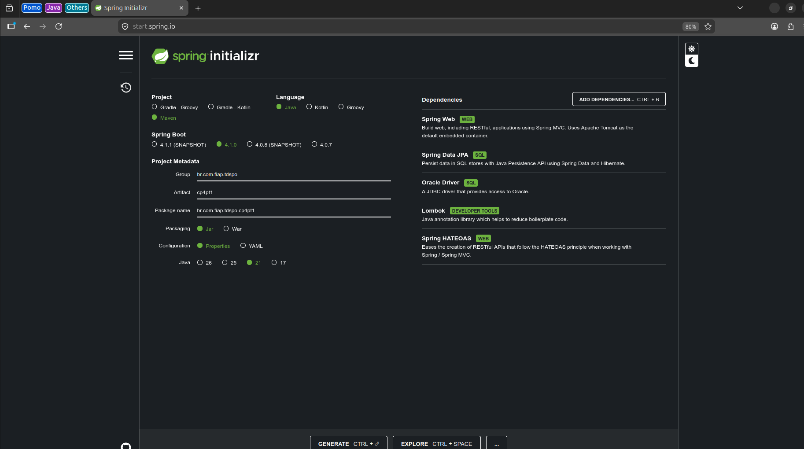
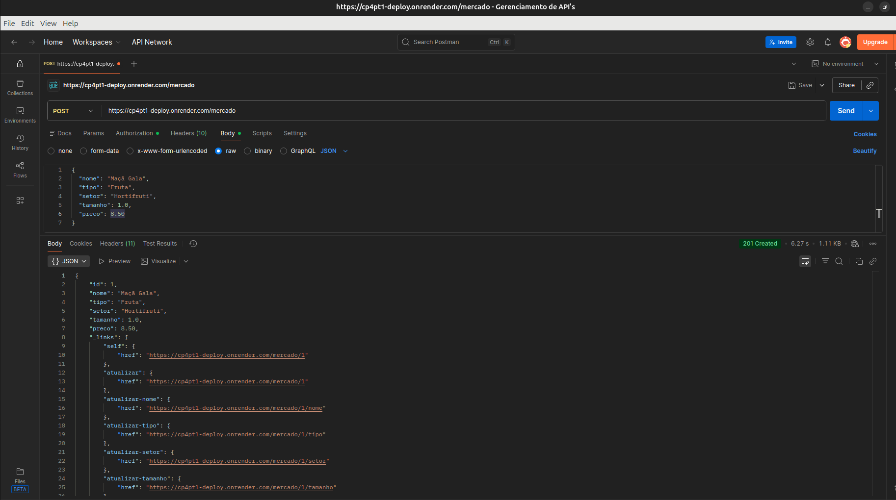
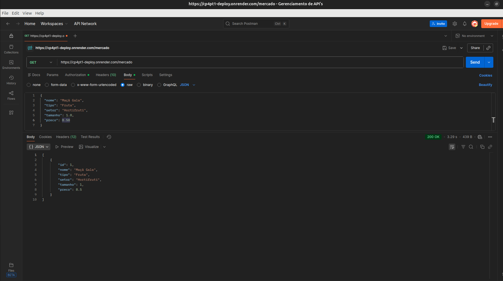
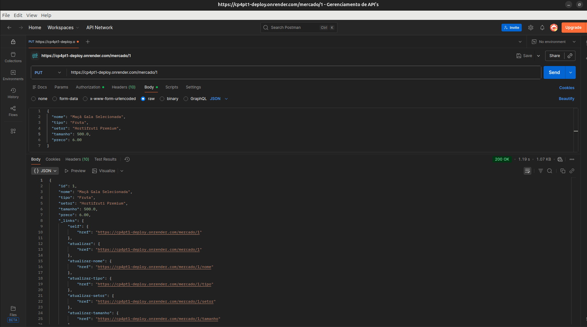

# 🛒 Mercado Express - API RESTful (CP4 Parte I)

## 📋 Descrição do Projeto

Este projeto é uma API RESTful desenvolvida em **Java com Spring Boot** para o gerenciamento de produtos de uma empresa do tipo "Mercado Express" (ex: frutas, produtos de limpeza, meias, etc.).

A aplicação implementa um CRUD completo (Create, Read, Update e Delete) com persistência de dados em um banco **Oracle**, além de aplicar os conceitos de **HATEOAS** (Nível 3 de Maturidade de Richardson) para fornecer controles de hipermídia nas respostas.

---

## 👥 Integrantes do Grupo (Ordem Alfabética)

* **Diego Andrade dos Santos** - RM: 566385
* **Grazielle de Alencar Silva** - RM: 561529
* **Julia Côrrea Souza** - RM: 564870
* **Rafael Kubagawa Ramos** - RM: 565572
* **Vinicius Soteras Braga** - RM: 566230

> **IDE Utilizada para o desenvolvimento:** IntelliJ IDEA

---

## ⚙️ Tecnologias e Dependências

O projeto foi gerado através do Spring Initializr utilizando as seguintes tecnologias:

* **Java** (Linguagem principal)
* **Maven** (Gerenciador de dependências)
* **Spring Boot Starter Web** (Para criação dos endpoints REST)
* **Spring Boot Starter Data JPA** (Persistência e mapeamento ORM)
* **Oracle Driver** (Conexão com o banco de dados FIAP)
* **Lombok** (Redução de boilerplate de código: Getters, Setters, Construtores)
* **Spring Boot Starter HATEOAS** (Implementação de links de hipermídia)

### 📸 Configuração do Spring Initializr



---

## 🗄️ Banco de Dados

O sistema utiliza o banco de dados **Oracle SQL Developer** (servidor FIAP). As configurações de conexão estão definidas no arquivo `application.properties`.

**Tabela Mapeada:** `TDS_TB_mercado`

| Coluna | Tipo (Exemplo) | Descrição |
| :--- | :--- | :--- |
| `Id` | `Long` | Chave primária autoincrementada |
| `Nome` | `String` | Nome do produto (ex: Sabão em pó) |
| `Tipo` | `String` | Categoria do produto (ex: Limpeza) |
| `Setor` | `String` | Corredor/Setor no mercado (ex: Corredor 3) |
| `Tamanho` | `String` | Tamanho ou peso (ex: 1kg, M, Grande) |
| `Preco` | `Double / BigDecimal` | Valor unitário do produto |

---

## 🚀 Como Executar o Projeto

1. Clone o repositório.
2. Certifique-se de que as credenciais do banco Oracle estão corretas no seu `application.properties`.
3. Execute a aplicação pela sua IDE (IntelliJ).
4. O servidor Tomcat iniciará localmente na **porta 8082**, conforme exigido.
5. Acesse os endpoints via Postman ou Insomnia em: `http://localhost:8082/mercado`

---

## 🧪 Endpoints e Testes de CRUD (com HATEOAS)

Abaixo estão as especificações dos endpoints criados, as estruturas JSON utilizadas e os resultados esperados. Todas as respostas GET contêm os links `_links` fornecidos pelo HATEOAS.

### 1. CREATE - Cadastrar Produto (POST)

* **Endpoint:** `POST http://localhost:8082/mercado`
* **Descrição:** Insere um novo produto no banco de dados.
* **Estrutura JSON (Payload enviado):**

```json
{
  "nome": "Maçã Gala",
  "tipo": "Fruta",
  "setor": "Hortifruti",
  "tamanho": 1.0,
  "preco": 8.50
}
```

📸 **Evidência no Postman:**



---

### 2. READ - Listar Produtos (GET)

* **Endpoint:** `GET http://localhost:8082/mercado`
* **Descrição:** Retorna todos os produtos cadastrados com links HATEOAS apontando para o detalhe de cada item.

📸 **Evidência no Postman:**



---

### 3. READ - Buscar Produto por ID (GET)

* **Endpoint:** `GET http://localhost:8082/mercado/{id}`
* **Descrição:** Busca um produto específico pelo seu Id.
* **Estrutura JSON de Retorno (Exemplo HATEOAS):**

```json
{
  "id": 1,
  "nome": "Maçã Gala",
  "tipo": "Fruta",
  "setor": "Hortifruti",
  "tamanho": "1kg",
  "preco": 8.50,
  "_links": {
    "self": {
      "href": "http://localhost:8082/mercado/1"
    },
    "lista_produtos": {
      "href": "http://localhost:8082/mercado"
    }
  }
}
```

📸 **Evidência no Postman:**


---

### 4. UPDATE - Atualizar Produto (PUT / PATCH)

* **Endpoint:** `PUT http://localhost:8082/mercado/{id}`
* **Descrição:** Atualiza os dados de um produto existente. Os dados são persistidos via `commit` no banco Oracle.
* **Estrutura JSON (Payload enviado para alteração):**

```json
{
  "nome": "Maçã Gala Selecionada",
  "tipo": "Fruta",
  "setor": "Hortifruti Premium",
  "tamanho": 500.0,
  "preco": 6.00
}
```

📸 **Evidência no Postman:**



---

### 5. DELETE - Excluir Produto (DELETE)

* **Endpoint:** `DELETE http://localhost:8082/mercado/{id}`
* **Descrição:** Realiza a exclusão do produto no banco de dados com base no ID informado na URL. Retorna status `204 No Content` em caso de sucesso.

📸 **Evidência no Postman:**


---

## 🌐 Deploy da Aplicação

A aplicação foi "deployada" e está acessível através do seguinte link:

👉 **[Link do Deploy - https://cp4pt1-deploy.onrender.com**

---

*"Quem ouve, esquece. Quem vê, lembra. Quem faz, aprende." - Provérbio chinês*
